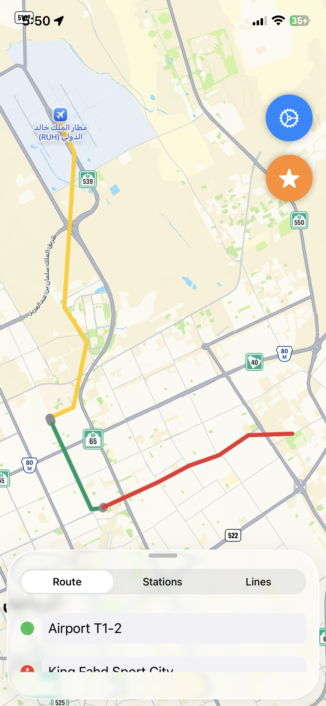
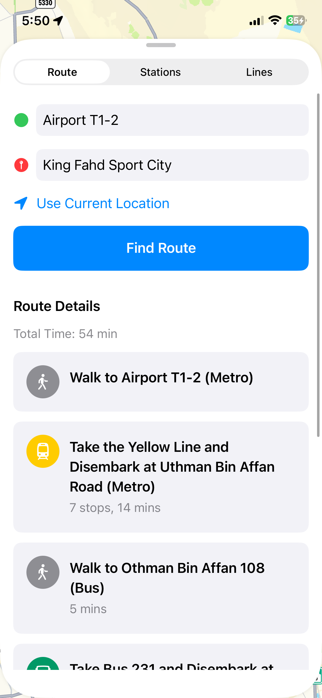
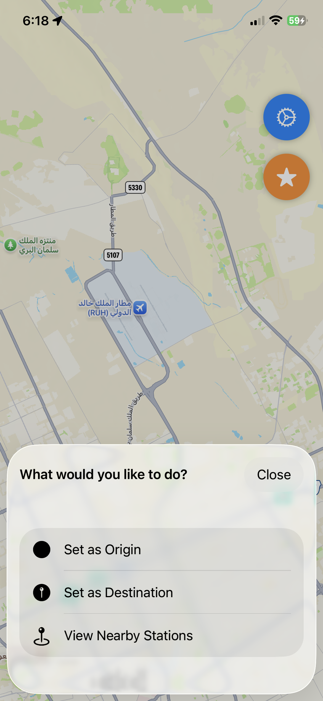
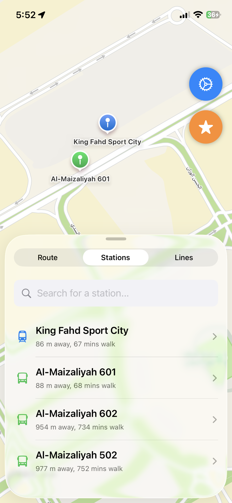
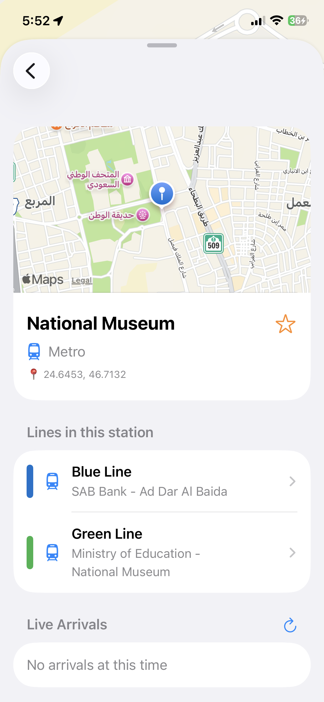
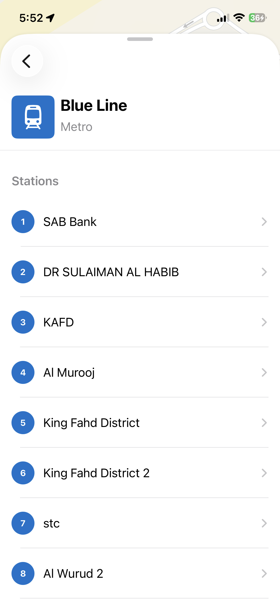
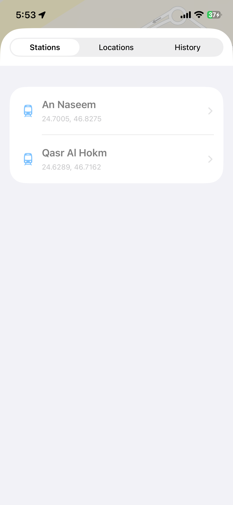
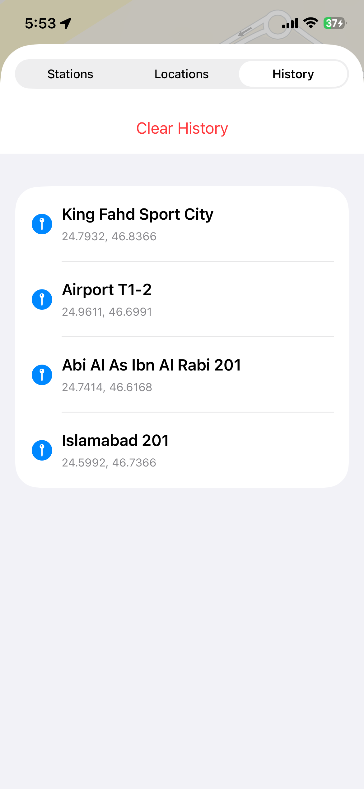

# Riyadh Transport - iOS App

A native iOS application for Riyadh public transport, built with Swift and SwiftUI. This app provides route planning, station information, and live arrival times for metro and bus services in Riyadh.

<div style="display: flex;">
    
    
    
    
    
    
    
    
</div>

## Overview

This iOS version is a port of the Android app, designed to provide a native iOS experience while retaining the core functionality. It uses **Apple Maps** instead of MapTiler for map display and follows iOS design patterns with SwiftUI.

## Features

- ✅ **Route Planning**: Find routes between locations using public transport
- ✅ **Station Search**: Browse and search all metro and bus stations
- ✅ **Live Arrivals**: View real-time arrival information for metro and buses
- ✅ **Interactive Map**: View stations and routes with Apple Maps
- ✅ **GPS Location**: Use your current location as starting point
- ✅ **Multilingual**: Supports English and Arabic (العربية)
- ✅ **Favorites**: Save favorite stations and locations
- ✅ **Search History**: Quickly access recently searched locations
- ✅ **Dark Mode**: Automatic dark mode support
- ✅ **Native iOS UI**: Built with SwiftUI for a native iOS experience

## Requirements

- iOS 15.5 or later (*Note:* iOS 15 does not support latest visual capabilites, UI may vary from screenshots)
- watchOS 8.5 or later (If you're installing on Apple Watch as well)
- Xcode 14.0 or later
- Swift 5.7 or later
- Active internet connection for API calls and map tiles

## Setup Instructions

### 1. Open in Xcode

```bash
cd iOS-App
open RiyadhTransport.xcodeproj
```

If the project file doesn't exist yet, create a new iOS App project in Xcode:
1. Open Xcode
2. File → New → Project
3. Choose "iOS" → "App"
4. Product Name: `RiyadhTransport`
5. Interface: SwiftUI
6. Language: Swift
7. Save in the `iOS-App` directory

### 2. Add Files to Project

Add all the Swift files and resources to your Xcode project:
1. Drag the folders (Models, Services, Utilities, Views, Resources) into the Xcode project navigator
2. Make sure "Copy items if needed" is checked
3. Select "Create groups" for folder references
4. Add to target: RiyadhTransport

### 3. Configure Info.plist

The Info.plist is already configured with:
- Location permissions
- Supported localizations (English and Arabic)
- App metadata

### 4. Build and Run

1. Select a simulator or connected iOS device
2. Click the Run button (▶️) or press Cmd+R
3. Grant location permissions when prompted

## Key Differences from Android Version

### Maps
- **Android**: Uses OSMDroid with MapTiler tiles
- **iOS**: Uses Apple Maps (MapKit)

### UI Framework
- **Android**: XML layouts with Activities and Fragments
- **iOS**: SwiftUI with declarative views

### Navigation
- **Android**: Fragment-based navigation with ViewPager
- **iOS**: NavigationView with NavigationLink

### Location Services
- **Android**: Google Play Services Location
- **iOS**: Core Location (LocationManager)

### Data Persistence
- **Android**: SharedPreferences
- **iOS**: UserDefaults and @AppStorage

## API Integration

### Endpoints Used:
- `GET /api/stations` - Get all stations
- `POST /nearbystations` - Find nearby stations
- `POST /route_from_coords` - Find route from coordinates
- `POST /metro_arrivals` - Get metro arrival times
- `POST /bus_arrivals` - Get bus arrival times
- `GET /buslines` - Get all bus lines
- `GET /mtrlines` - Get all metro lines

## Localization

The app supports both English and Arabic:

- English strings: `Resources/Localizable.strings`
- Arabic strings: `Resources/ar.lproj/Localizable.strings`

The app automatically uses the device's language setting. Users can also change the language in Settings.

## Permissions

The app requires the following permissions:

- **Location Services**: For GPS-based features like nearby stations and current location
  - `NSLocationWhenInUseUsageDescription` in Info.plist

## Metro Line Colors

The app uses color-coded metro lines:

- Line 1 (Blue): Blue
- Line 2 (Red): Red
- Line 3 (Orange): Orange
- Line 4 (Yellow): Yellow
- Line 5 (Green): Green
- Line 6 (Purple): Purple

## SwiftUI Components

### Main Views
- **ContentView**: Main container with map and bottom sheet tabs
- **RouteView**: Route planning interface
- **StationsView**: Station list with search
- **LinesView**: Metro and bus lines browser

### Detail Views
- **StationDetailView**: Station details with live arrivals
- **LineDetailView**: Line details with station list
- **FavoritesView**: Manage favorite stations and locations

### Supporting Views
- **MapView**: UIViewRepresentable wrapper for MKMapView
- **SettingsView**: App settings and preferences

## Known Limitations

- Backend server must be running and accessible
- Some features require active internet connection
- Map tiles are downloaded on demand (requires internet)
- Live arrival data depends on backend availability

## Testing

### On Simulator
1. Use Xcode's built-in iOS Simulator
2. Features → Location → Custom Location to test GPS features

### On Device
1. Connect iPhone/iPad via USB or WiFi
2. Enable Developer Mode in device settings
3. Run from Xcode

## Future Enhancements

- [ ] Offline mode with cached data
- [ ] Push notifications for service alerts
- [ ] Widget support for favorite stations
- [x] Apple Watch companion app
- [ ] Siri shortcuts integration

## Architecture

The app follows SwiftUI best practices:

- **MVVM-like pattern**: Views observe @StateObject and @EnvironmentObject
- **Single source of truth**: Managers like FavoritesManager and LocationManager
- **Declarative UI**: SwiftUI views with @State and @Binding
- **Reactive**: Combine framework for async operations

## Code Quality

- Swift 5.7+ features
- Type-safe API with Codable
- Error handling with Result type
- Memory management with weak references
- Proper separation of concerns

## Contributing

This iOS app is part of the Riyadh Transport project. To contribute:

1. Fork the repository
2. Create a feature branch
3. Make your changes
4. Test on both iOS simulator and device
5. Submit a pull request

## License

Same as the parent project.

## Support

For issues or questions:
- Open an issue on the GitHub repository
